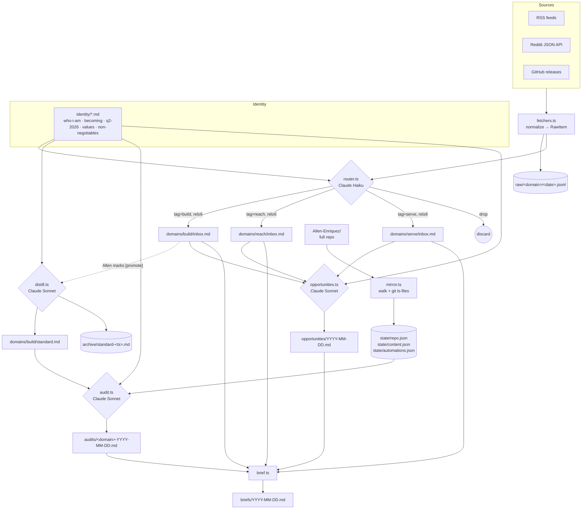

# Enriquez2.0 — System Overview

## What it does

Pulls world signal (RSS, Reddit, GitHub releases), filters every item through Allen's identity files (who he is, what he's becoming, Q2 anchor), and routes high-relevance items into one of three domain inboxes: BUILD (how we ship), REACH (how we grow audience), SERVE (how we turn audience into clients). Allen reviews inboxes, marks winners, and the system distills them into per-domain "what good looks like" standards. A mirror script snapshots Allen's actual repo state. An auditor compares standard vs reality and writes a gap report. A new opportunity scanner surfaces inbox items proposing NEW moves (markets, scripts, approaches). A daily brief stitches everything together so Allen sees signal + gaps + opportunities in one read.

## Data flow

## Entry points

| Command | File | What it does |
|---|---|---|
| `npm run ingest -- --domain <d> --since 7d` | `scripts/ingest.ts` | Fetches sources for one domain (or `all`), routes via Haiku, appends rel≥6 items into inbox.md |
| `npm run distill -- --domain <d>` | `scripts/distill.ts` | Reads inbox items marked `promote`, folds them into standard.md via Sonnet, archives prior version |
| `npm run mirror` | `scripts/mirror.ts` | Walks repo + `git ls-files`, writes state/*.json |
| `npm run audit -- --domain <d>` | `scripts/audit.ts` | Compares standard.md vs state, writes audits/&lt;domain&gt;-YYYY-MM-DD.md |
| `npm run opportunities` | `scripts/opportunities.ts` *(Phase 6 step 6)* | Filters inboxes for items proposing NEW moves, writes opportunities/YYYY-MM-DD.md |
| `npm run brief` | `scripts/brief.ts` | Concatenates top inbox items + audit summary + opportunities into briefs/YYYY-MM-DD.md |

## Inputs

- `domains/<d>/sources.yaml` — RSS feeds, GitHub repos, Reddit subreddits, hot_threshold per domain.
- `identity/*.md` — five hand-edited markdown files. Every Claude call loads all five.
- `ANTHROPIC_API_KEY` — env var, picked up from `projects/personal/.env` or `projects/eps/.env` via `lib/env.ts`.
- `GITHUB_TOKEN` — optional, increases GitHub API rate limit.

## Outputs

- `domains/<d>/inbox.md` — markdown table, append-only with dedupe by URL.
- `domains/<d>/standard.md` — one-pager per domain, rewritten on every distill, prior version archived to `domains/<d>/archive/`.
- `state/repo.json`, `state/content.json`, `state/automations.json` — overwritten each mirror run.
- `audits/<d>-YYYY-MM-DD.md` — one per domain per day.
- `opportunities/YYYY-MM-DD.md` — one per day.
- `briefs/YYYY-MM-DD.md` — one per day.
- `raw/<d>/<date>.jsonl` — gitignored append-only log of every fetched item.

## Failure modes

| What | Where it surfaces | How to detect |
|---|---|---|
| RSS feed timeout / 4xx | `console.error("[rss] <url>: <msg>")` | Stderr in ingest run; item just missing from inbox |
| Reddit rate-limit / blocked UA | `console.error("[reddit] r/: <status>")` | Same |
| Haiku JSON parse failure | item silently drops with relevance 0 | Spot-check raw/<date>.jsonl vs inbox.md for missing items |
| Sonnet returns empty body (audit/distill) | empty file written | Verify file size > 1KB after run |
| Missing `ANTHROPIC_API_KEY` | `requireEnv` throws on first router call | Hard fail at startup |
| Identity file missing | `loadIdentity()` skips silently | Audits get worse without warning — check `identity/` is intact |

No log files. All output goes to stdout/stderr. Run from terminal to see failures.

## Dependencies

- **External:** Anthropic API (Haiku + Sonnet), GitHub API, Reddit JSON, RSS feed hosts.
- **Internal:** none — sits alongside `tools/content-hub/`, doesn't import from it. Mirror reads repo state but doesn't write outside `tools/enriquez2.0/`.
- **Memory:** identity files seed from `projects/personal/CONTEXT.md` (verbatim sections, hand-curated).
- **Future:** opportunities.ts will reuse `lib/identity.ts` and the Sonnet pattern from `audit.ts`.

## Last verified

2026-04-25 @ 3774fb5
